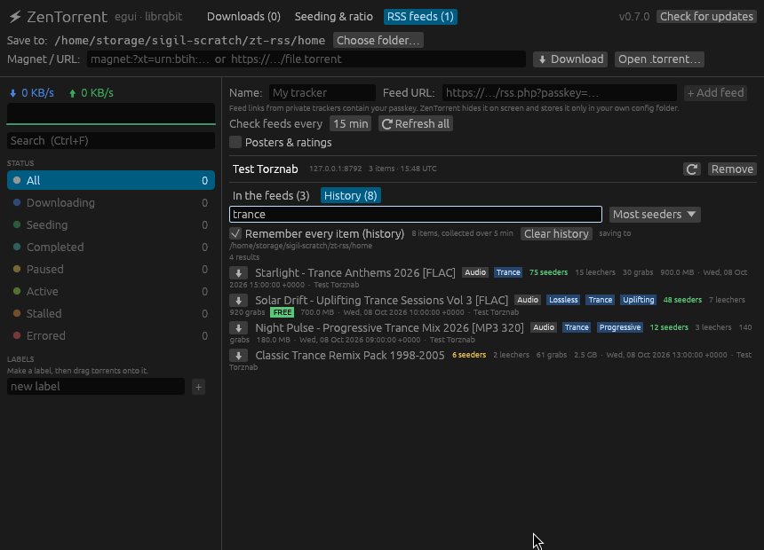
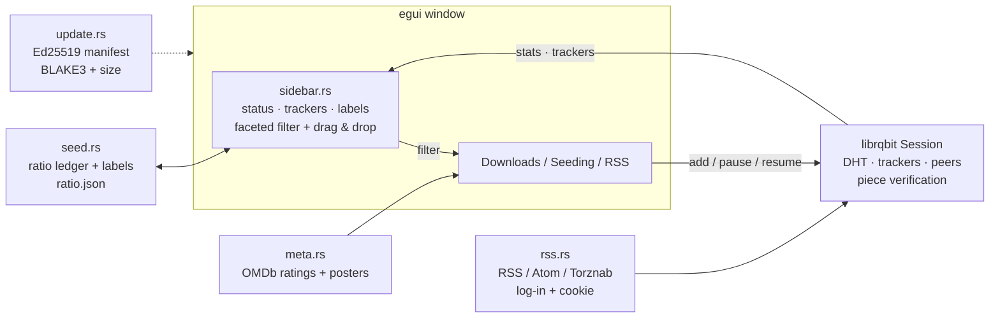

<div align="center">

<a href="https://deme-plata.github.io/zentorrent/">
  
</a>

<sub>▲ The swarm, rendered in <b>three.js</b>. <a href="https://deme-plata.github.io/zentorrent/">Open the live 3D scene →</a> (move your mouse)</sub>

<br><br>

**A fast, ad-free desktop BitTorrent client in Rust.**<br>
No ads. No bundled toolbars. No telemetry. Just the swarm.

<br>


</div>

---

## Why another torrent client?

Most torrent clients still look like it is 2008, and the popular ones wrap the
download in ads and bundled offers. ZenTorrent is one small native binary: an
[egui](https://github.com/emilk/egui) window over the
[librqbit](https://github.com/ikatson/rqbit) engine. It starts instantly, and
everything in it exists because someone needed it on a real private tracker.

## ✨ What's in it

### The sidebar — a navigator, not a list of folders *(new in 0.6)*


| | |
|---|---|
| **Live status facets** | All · Downloading · Seeding · Completed · Paused · **Active** (moving bytes now) · **Stalled** (no one has your missing pieces) · Errored |
| **Faceted counts** | Status, tracker and label combine. Every number is computed with the *other* filters applied, so it always tells you what you'd see if you clicked it. |
| **Trackers, by site** | `tracker.torrentleech.org` and `tleechreload.org` are both **TorrentLeech**; `udp://tracker.opentrackr.org` is **OpenTrackr**. Private trackers show 🔒 and your **ratio on that tracker**. Announce URLs carry your passkey, so only the host is ever shown. |
| **Needs seeding 🔒** | A smart view: private torrents that are finished but still below your ratio goal. Leave these running and your account stays healthy. |
| **Labels** | Make your own (Film, Linux, Keepers…). Tag torrents from the row's **Labels** menu, or… |
| **Drag & drop** | …drag a torrent's name onto a label to tag it, onto **Paused** to pause it, onto **Downloading/Seeding** to resume it. |
| **Search** | `Ctrl+F`. Matches names, labels and tracker names. |
| **Speed sparkline** | The last 90 seconds of ⬇/⬆ at a glance. |

### Details: one torrent, up close *(new in 0.7)*


Press **Details** on any torrent:

| | |
|---|---|
| **Live speed graph** | 5 minutes of ⬇/⬆ as gradient areas on a scale that always lands on round numbers. Hover for the exact speed at any second. |
| **Status** | Downloaded, lifetime upload and ratio, speed, time left, peers, seeding time, pieces verified, average piece time. |
| **Details** | Info hash and magnet link (one click to copy, hash and name only), save folder, piece size, and trackers shown as host only. Your passkey never appears. |
| **Files** | Choose which files to download, with per-file progress and a **Largest only** button for the one film or ISO in a pack. |
| **Peers** | Everyone you're trading with: address, client (qBittorrent, Deluge, µTorrent…), TCP/uTP, and what you got from and sent to each. |
| **Settings** | **This torrent's own download/upload limits**, applied instantly with no restart or re-check. Its own seed goal, labels, pause/resume. Plus limits for **all torrents**. Everything is remembered across restarts. |

### RSS search and history *(new in 0.7.1)*



- **History:** feeds only list their newest items. Tick *Remember every item* and ZenTorrent keeps everything it has seen, so search reaches back to the day you switched it on. It's stored only on your computer.
- **Seeders, leechers, grabs and freeleech** on every item, read from Torznab, ezRSS and Nyaa feeds, and from the "Seeders: 12" text that classic private trackers put in descriptions.
- **Search** with typo tolerance (`tarnce` finds trance) and filters:

| you type | finds |
|---|---|
| `trance` | the word anywhere; titles rank first |
| `genre:trance` | genre or tag only (`cat:music`, `feed:torrentleech` too) |
| `seeders>10` `size<2gb` `grabs>=100` | by the numbers |
| `"group therapy"` · `-remix` · `free` | exact phrase · leave out · freeleech only |

- **Sort** by best match, **most seeders**, **most active** (downloads per hour since first seen), newest, largest or name.

### The Downloads list *(new in 0.10)*

Three layouts, switched with the icons above the list and remembered:

- **Cards**: every detail and button, as before.
- **Compact**: one line per torrent with a status dot, bar, size and speeds. Double-click opens Details, right-click has the actions, drag a row onto a label.
- **Thumbnails**: the film or show's poster (when ratings are on) or a colour tile, a progress ring, and a ▶ on hover.

Sort by added, name, size, progress, speed, ratio or status, and filter to **Video / Music / Other** (by where the bytes are; scene RAR sets count as video). The sidebar's filters still apply.

### Watch while it downloads *(0.8.3 – 0.8.5)*

- **Built-in player** (libmpv, high-quality renderer): Play streams the pieces where the playhead is, so it starts before the download is done.
- **Inside the archive**: multi-part RAR, ZIP and TAR sets play directly, no unpacking.
- The video window closes with its close button, **Esc** or **Q** (Esc in fullscreen leaves fullscreen first).

### ✨ Flux MoE — a media assistant on your own computer *(0.9)*

A local model (installed and set up for you through Ollama, on your GPU when it fits) that knows your torrents, files and feed history: give an overview, **top picks** from thousands of feed items mixed across genres with a ⬇ per row, play things, build playlists, and tidy folders behind a preview you approve (with undo). Live progress shows tokens per second, VRAM and whether it runs on the GPU or the CPU.

### Info tab

A torrent's **.nfo** is shown the way it was drawn (code page 437, monospace), READMEs as rich text.

### 🔌 MCP: let your own AI drive it *(new in 0.10)*

ZenTorrent speaks the [Model Context Protocol](https://modelcontextprotocol.io): Claude Code or any MCP client can list your torrents, search the feeds (top picks too), add, pause, resume and play.

- **In the app**: tick **MCP** in the Flux MoE tab. It listens on `127.0.0.1` only, with a token. Downloads and file moves a client asks for appear as cards **you** confirm.
- **On a server**: `zentorrent serve` runs the engine, your feeds (with auto-download) and the MCP server without a window. Whoever starts it hands control to the client, so actions happen directly.
- Connect Claude Code with the line `zentorrent mcp-config` prints, or use `zentorrent mcp` (a stdio bridge) for clients that start a command.
- Feed links carry passkeys, so they never leave the app: results use ids.

### Everything else

- **Seeding & ratio ledger.** Lifetime upload per torrent survives restarts (librqbit's own counter resets every run). Stop seeding at a ratio or after N hours.
- **RSS / Atom / Torznab feeds** with regex auto-download. The first read only primes the rule, so you never get a flood of the backlog.
- **Private-tracker log-in.** One browser-like identity for feed, log-in and download, because TBDev sites bind the session to the User-Agent. The password is used once and never stored.
- **Posters and ratings** in feeds: IMDb, Rotten Tomatoes and Metascore via the OMDb API (HTTPS, cached, rate-limited). No page scraping.
- **Resumes after restart.** Downloads and seeding pick up where they stopped.
- **Signed self-update.** An Ed25519-signed manifest plus a BLAKE3 + size check before `self_replace`. A tampered binary is refused.

## 📦 Install

Grab a build from **[GitHub Releases](https://github.com/deme-plata/zentorrent/releases/latest)**. After that, the **Update** button in the top-right corner keeps you current:

| Platform | GitHub Releases | Mirror |
|---|---|---|
| Windows x64 | [`zentorrent-0.10.0-windows-x64.exe`](https://github.com/deme-plata/zentorrent/releases/download/v0.10.0/zentorrent-0.10.0-windows-x64.exe) | [quillon.xyz](https://quillon.xyz/downloads/zentorrent-0.10.0-windows-x64.exe) |
| Linux x64 | [`zentorrent-0.10.0-linux-x64`](https://github.com/deme-plata/zentorrent/releases/download/v0.10.0/zentorrent-0.10.0-linux-x64) | [quillon.xyz](https://quillon.xyz/downloads/zentorrent-0.10.0-linux-x64) |

Both are byte-identical to what the in-app updater installs. Their BLAKE3 hashes are in the Ed25519-signed [`zentorrent-latest.json`](https://quillon.xyz/downloads/zentorrent-latest.json).

```bash
chmod +x zentorrent-0.10.0-linux-x64 && ./zentorrent-0.10.0-linux-x64
```

On Linux the built-in player uses the system's libmpv (`sudo apt install libmpv2`); on Windows
ZenTorrent fetches and verifies its own copy on the first Play.

## 🛠 Build from source

```bash
git clone https://github.com/deme-plata/zentorrent && cd zentorrent
cargo build --release          # plain cargo works fine
```

We build it with [**Flux**](https://github.com/deme-plata/flux) (`fluxc build --release`), the
same toolchain behind [SigilGraph](https://github.com/deme-plata/sigilgraph). It adds a
content-addressed compile cache, a per-build compile-cost verdict, and webhooks on build/test
events. Every release is stamped with a [`flux-rev`](https://github.com/deme-plata/flux)
BLAKE3 content id, so anyone can re-snapshot the tree and check it.

### Headless modes (handy for testing and servers)

| command | does |
|---|---|
| `zentorrent --cli <magnet / url / file> [dir]` | download with a progress line, no window |
| `zentorrent --feed <url>` | print what the feed parser sees (passkey masked) |
| `zentorrent --fetch <torrent-url> [cookie]` | fetch one .torrent the way the app does |
| `zentorrent --login <feed-url> <user> <pass>` | tracker log-in with proof |
| `zentorrent --update` | check the signed channel, install if newer |
| `zentorrent serve [folder] [--port N]` | the engine, the feeds and the MCP server, no window (Ctrl-C stops) |
| `zentorrent mcp` | MCP over stdin/stdout, forwarded to the running ZenTorrent |
| `zentorrent mcp-config` | the `claude mcp add …` line for this install |
| `zentorrent --ask "<question>" [folder]` | one Flux MoE turn in the terminal (actions printed, not done) |

## 🧭 How it fits together



| file | job |
|---|---|
| `src/main.rs` | the window, tabs, transfer list, CLI modes |
| `src/sidebar.rs` | the faceted navigator: statuses, tracker → site grouping, labels, drag & drop, sparkline |
| `src/details.rs` | the Details panel: speed graph, Status / Details / Files / Peers / Settings tabs |
| `vendor/librqbit` | librqbit 9.0.1 plus **one** added getter, so a torrent's speed limits can change while it runs ([why](vendor/README-zentorrent.md)) |
| `src/rss.rs` | feed parser (RSS 2.0 / Atom / Torznab / ezRSS / Nyaa, seeders + grabs + freeleech), `.torrent` fetch + validation, tracker log-in |
| `src/history.rs` | every feed item ever seen, with seeders and grabs over time (history.json, 0600) |
| `src/search.rs` | the RSS search: words, prefixes, typos, phrases, filters, six sort orders |
| `src/meta.rs` | release-name → title/year guesser, OMDb lookups, poster cache, daily budget |
| `src/seed.rs` | lifetime ratio ledger, seed goals, labels |
| `src/update.rs` | signed self-updater |

## 🔐 Privacy & security, in plain words

- **Your passkey never appears on screen.** Feed URLs are masked, the sidebar shows tracker *hosts* only, and every error message strips the URL.
- `feeds.json` is written `0600`. Cookies are session credentials and are treated that way.
- **Your password is not stored.** ZenTorrent logs in once and keeps only the session cookie.
- Private torrents never touch DHT or LSD (the `private` flag is honoured by librqbit).
- All HTTP goes over **rustls**. Posters are HTTPS-only and size-capped.
- Updates are refused unless the manifest's **Ed25519 signature** verifies against a key pinned in the binary, *and* the download matches its BLAKE3 hash and size.

## 🗺 Roadmap

- [x] Sidebar: status / tracker / label facets, drag & drop, per-tracker ratio *(0.6)*
- [x] Details panel: speed graph, files, peers, per-torrent and global speed limits *(0.7)*
- [x] RSS search (genre, seeders, activity) and a history that remembers every feed item *(0.7.1)*
- [ ] Opt-in, anonymous usage statistics *(0.8)*
- [x] **Flux MoE assistant tab**: overview, feed search and top picks, play, playlists, tidy folders *(0.9)*
- [ ] **IronTunnel**: a built-in Rust VPN tunnel to bind torrent traffic to *(in progress)*
- [x] Built-in audio/video player, streaming while downloading, inside RAR/ZIP/TAR *(0.8.3 – 0.8.5)*
- [x] MCP server and headless `zentorrent serve` *(0.10)*
- [x] Downloads list: compact and thumbnail layouts, sort and media filter *(0.10)*
- [ ] Speed schedules · tray icon · macOS build

## License

Dual-licensed under **MIT OR Apache-2.0**, at your option.

<div align="center"><sub>⚡ Made with care on the Flux toolchain · <a href="https://deme-plata.github.io/zentorrent/">live 3D swarm</a></sub></div>
